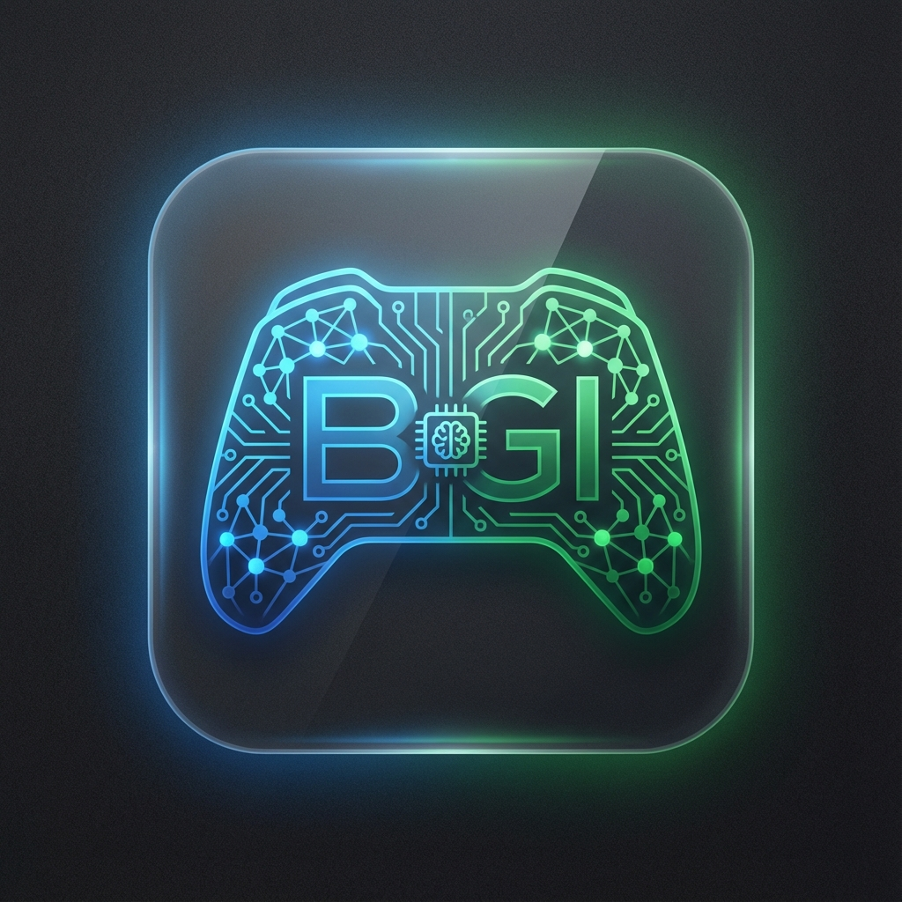

<div align="center">



# BetterGI-Next

Xbox 云游戏自动化引擎

[]()
[](https://www.xbox.com/play)

</div>

---

## 简介

BetterGI-Next 是一个运行在浏览器中的用户脚本，通过 OpenCV.js 进行画面识别，配合 Better-xCloud 的输入通道模拟手柄操作，实现游戏内自动化任务（如自动跳过剧情对话）。

---

## 依赖

- [Better-xCloud](https://github.com/nicenemo/better-xcloud) — 提供 `window.BX_EXPOSED.inputChannel`
- Tampermonkey / Violentmonkey

---

## 快速开始

```bash
# 安装依赖
npm install

# 开发模式（watch + 增量构建）
npm run dev

# 生产构建
npm run build
```

产物位于 `dist/bettergi-next.user.js`，导入到脚本管理器即可。

---

## 项目结构

```
src/
├── index.ts            # 入口
├── core/
│   ├── engine.ts       # 主引擎：任务调度、配置管理
│   ├── vision.ts       # 视觉系统：截屏、帧缓存、Worker 通信
│   ├── input.ts        # 输入系统：手柄模拟
│   ├── algo.ts         # 素材注册与匹配入口
│   ├── base-task.ts    # 任务基类
│   └── config-manager.ts
├── worker/
│   └── vision.ts       # OpenCV.js 模板匹配（Web Worker）
├── ui/
│   ├── overlay.tsx     # Shadow DOM 覆盖层
│   └── components/     # Preact 组件
└── modules/
    └── tasks/          # 具体任务实现
```

---

## 核心流程

1. **截屏**：从 `<video>` 取帧，drawImage 到 Canvas
2. **下发**：通过 `Transferable` 将 `ImageData` 发送给 Worker
3. **匹配**：Worker 端 OpenCV `matchTemplate`，返回得分和坐标
4. **动作**：得分超阈值后调用 `InputSystem.tap('A')` 发送按键

---

## 性能调优

默认配置已针对 1080p 场景优化：

| 参数 | 默认 | 说明 |
|------|------|------|
| downsample | 0.33 | 降采样率 |
| adaptiveScaling | true | 单尺度失败后扩展 |
| earlyTermination | true | 高分提前返回 |
| frameCacheEnabled | true | 帧级去重 |

详见 [性能优化报告](./docs/PERFORMANCE_OPTIMIZATION.md)

---

## 开发任务

继承 `BaseTask`，实现 `loop()` 方法：

```typescript
class MyTask extends BaseTask {
    name = 'my-task';

    async onRegister() {
        await this.ctx.algo.register('icon', '/path/to/icon.png');
    }

    async loop() {
        const screen = this.ctx.vision.getImageData();
        const result = await this.ctx.algo.findAsync(screen, 'icon', {
            threshold: this.ctx.engine.config.threshold
        });
        if (result.score >= this.ctx.engine.config.threshold) {
            await this.ctx.input.tap('A');
        }
    }
}
```

---

## 调试

控制台：

```js
window.BetterGi.engine            // 引擎实例
window.BetterGiDiag.check()       // 检查 Better-xCloud 连接
window.BetterGi.engine.input.tap('A', 200)  // 测试按键
```

UI 面板可实时调整阈值、降采样率，观察识别效果。

---

## 技术栈

- TypeScript
- Preact (UI)
- OpenCV.js (Worker)
- esbuild (构建)

---

## License

ISC
