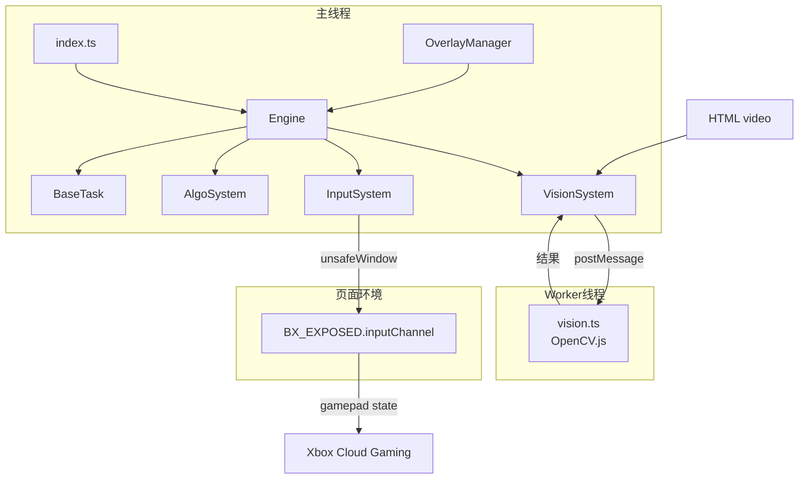
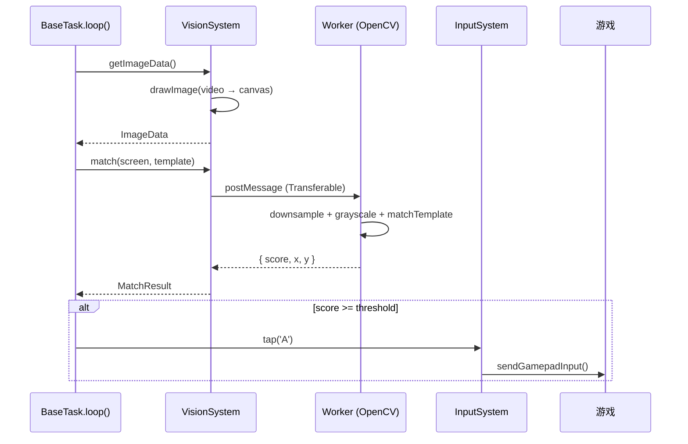

# 架构

## 模块关系

## 数据流

## 模块说明

### Engine

任务调度器。接收 UI 事件，管理任务生命周期，广播状态变化。不直接处理截屏或按键。

### VisionSystem

- 锁定页面 `<video>` 元素
- 每帧 drawImage 到 Canvas，取 ImageData
- 帧哈希去重，相同帧不重复发给 Worker
- 与 Worker 通信使用 Transferable 零拷贝

### InputSystem

- 通过 `unsafeWindow.BX_EXPOSED.inputChannel` 拿到 Better-xCloud 输入通道
- 维护 gamepad state，`tap(button, ms)` 模拟按键
- 对象传递前用 `JSON.parse(JSON.stringify())` 净化

### AlgoSystem

素材管理。注册模板 (Base64 → ImageData)，提供 `findAsync()` 接口。

### BaseTask

任务基类。子类实现 `loop()`，框架处理循环调度。

---

## 关键设计决策

| 问题 | 方案 |
|------|------|
| matchTemplate 阻塞主线程 | 放到 Web Worker |
| 访问 BX_EXPOSED 失败 | 使用 unsafeWindow 穿透沙箱 |
| 沙箱对象跨环境传递失败 | JSON 序列化净化 |
| UI 样式冲突 | Shadow DOM 隔离 |
| 重复帧浪费计算 | 帧哈希缓存 |

---

## 事件

| 名称 | 方向 |
|------|------|
| TASK_START | UI → Engine |
| CONFIG_UPDATE | UI → Engine |
| ENGINE_STATE_CHANGE | Engine → UI |
| DEBUG_UPDATE | Task → DebugLayer |

---

## 扩展

- 新任务：继承 BaseTask
- 新算法：改 worker/vision.ts
- 新配置：加 config-manager.ts
